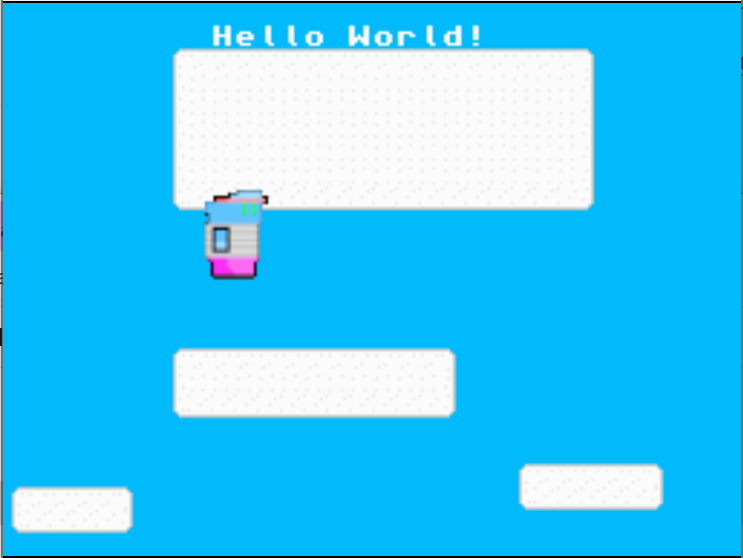

===============
Getting Started
===============

----------------------------------
Installing the DevKitPro toolchain
----------------------------------

Before downloading Morpheus, we need to install the
DevKitPro toolchain that will be used to cross-compile our
code for the Game Boy Advance (GBA) and the DS. In order to install
the necessary components needed, follow
`this guide <https://devkitpro.org/wiki/Getting_Started>`_ and make sure
to install the GBA and the DS (or NDS) developer libraries (also known
as gba-dev and nds-dev).

-------------------
Installing Python 3
-------------------

For many of the build scripts to function, a working Python 3 installation
is needed. While the scripts have only been tested on Python 3.8 and Python
3.9, any Python version above 3.6 should work fine (If you still run
into trouble with 3.6 or 3.7, install one of the tested versions).
You can install Python from `The Python Software Foundation's website
<https://www.python.org/downloads/>`_ or through your preferred package
manager (sudo apt install python3 on Debian/Ubuntu).

----------------
Installing CMake
----------------

For building Morpheus projects, we strongly recommend that you use CMake
as it is the easiest and most cross-platform way to build your Morpheus
projects. You can install CMake from
`cmake.org <https://cmake.org/download/>`_ or through your preferred
package manager (sudo apt install cmake on Debian/Ubuntu).

-------------------
Installing Morpheus
-------------------

Now that the toolchain, CMake, and Python 3 has been installed, we can now
install Morpheus! Download the library package from the itch page
`here <https://insighted.itch.io/morpheus>`_

.. warning::
    Builds ending with -dev are unstable developer builds created upon every
    commit to the dev branch. Use builds ending with -release if you want to
    download the latest stable release.

---------------------------
Creating your first project
---------------------------

After you download the Morpheus library package and extract the zip file, you can
use the Project Generator buildtool located in the buildtools/project_generator
folder of the Morpheus release package to generate the project.
You can do this by using your respective python interpreter
(python on Windows, python3 otherwise) to run the buildtool like so:

``python3 <morpheus dir>/buildtools/project_generator/project_generator.py <morpheus dir> <new project name> <project directory>``

where <morpheus dir> is the directory you extracted the Morpheus release package to,
<new project name> is the new Morpheus project name, and <project directory> is the
(optional) directory to place the new project in. If a <project directory> is not given,
the project will be created in the current working directory. Afterwards, you can generate
builds by invoking cmake on the build directory with the PLATFORM environment variable either
set to gba for the Game Boy Advance or nds for the Nintendo DS. For example, if you build
for the Game Boy Advance, the command would look like

``PLATFORM=gba cmake <src dir>``

in Linux/macOS and

``$env:PLATFORM=gba cmake <src dir>``

in Windows Powershell, assuming <src dir> is the path to the source dir, and you are building for the GBA.

If you are building on Windows, I suggest you use the "NMake Makefiles" as I've had the most
success compiling Morpheus with that generator. In addition, you might need to specify the
python3 executable if it not found by CMake. Doing both of these suggestion would result in the
following recommended command for building on Windows:
``$env:PLATFORM="gba"; cmake .. -G"NMake Makefiles" -DPYTHON3="C:\Program Files\Python39\python.exe"``
From there, you should be able to build Morpheus by invoking nmake within the build folder.

assuming that you have the 64-bit version of Python 3.9 installed in the standard location on the C drive
and that you are compiling for the GBA.

Afterwards you should be able to build the project, and run the generated roms
on an emulator. If all goes well, you should see something like this:

